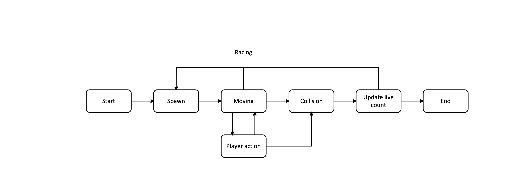
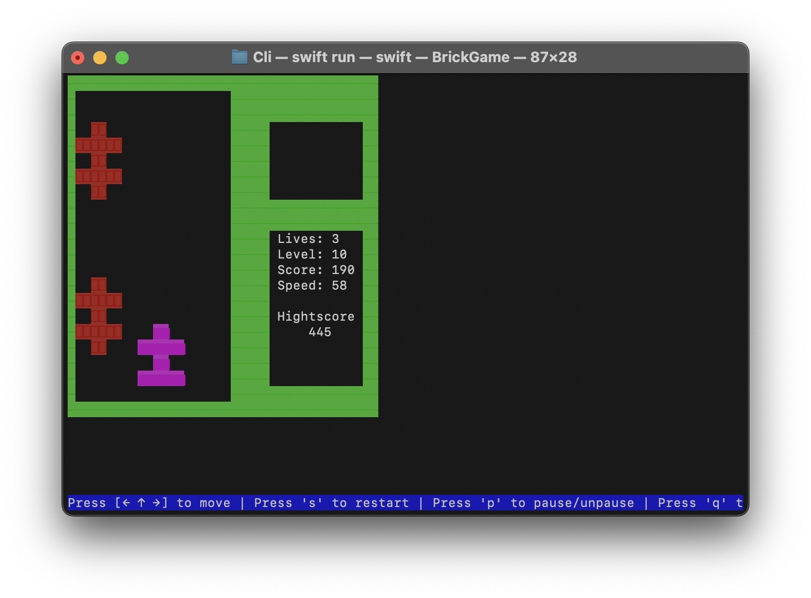
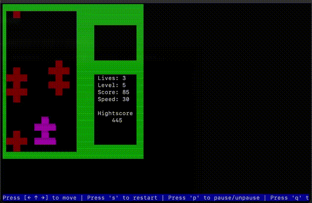
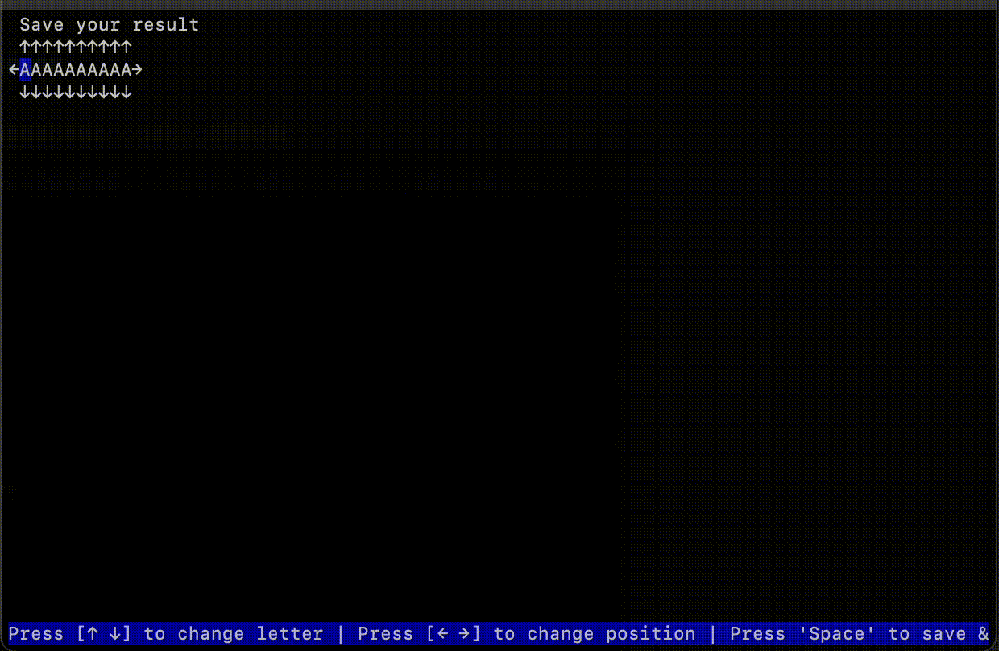
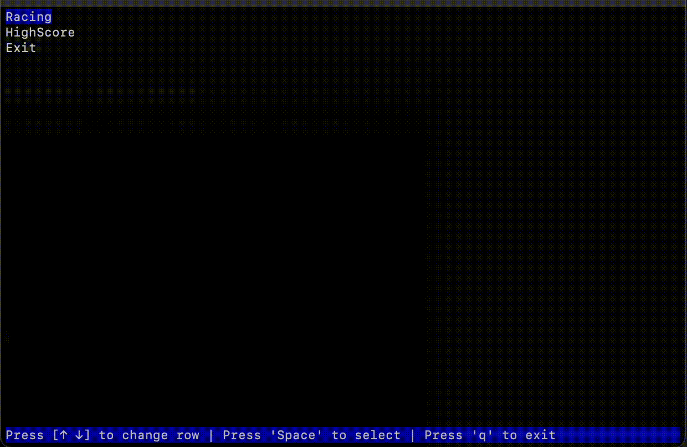
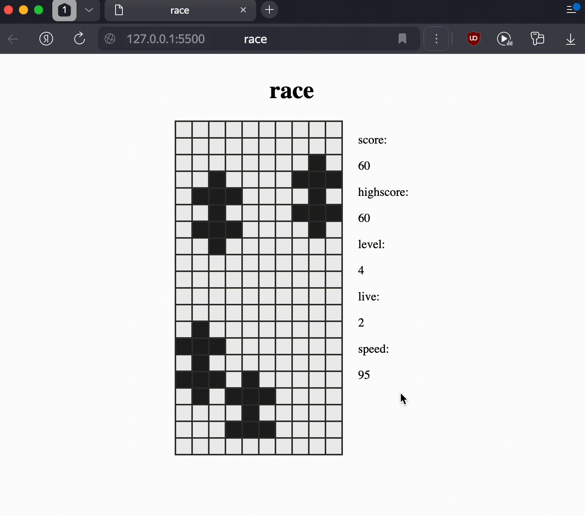

#  BRICKGAME_v3_RACE

Проект BRICKGAME_v3_RACE представляет реализацию игры Race с консоли BrickGame на языке Swift 

### Race

В игре прежвставлена реализация конечного автомата который можно описать по схеме представленной ниже:

Игра подерживает управление с клавиатуры:

- `S` - старт/рестарт игры
- `←` `→` - передвижение влево и вправо
- `↑` - ускорение игры
- `P` - пауза/запуск игры
- `Q` - выход из игры
- `Space` - подтвержение действий

### Cli

 
  
 Gameplay 

В Cli версии реализована возможность ввода имени для сохранения вашего результата

А так же возможность просмотра таблицы лучших игроков 

### Web

В Web версии существует механика жизней, то есть можно совершать ошибки во время игры

